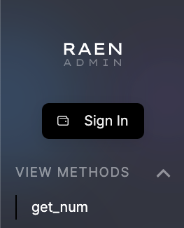
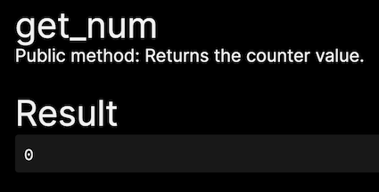
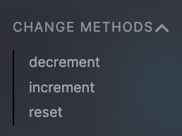
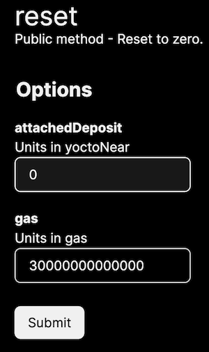

# Using RAEN Admin

Now that your RAEN-built contract provides interface information, [RAEN Admin](https://raen.dev/admin) can use it to generate a complete interactive form.

If you followed along and published your own contract, enter its address in RAEN Admin. Otherwise, you can follow along with [`counter.raendev.testnet`](https://raen.dev/admin/#/counter.raendev.testnet).

## View Methods

First to notice on the top left you have a login button and a list of the view methods

Clicking on [`get_num`](https://raen.dev/admin/#/counter.raendev.testnet/GetNum) will immediately call the view method since it has no arguments.

You can also notice that the comment from the code is displayed helping to describe the method.

---------------

## Change Methods

Below the View Methods are the Change Methods which update contract state.

Let's pick [`reset`](https://raen.dev/admin/#/counter.raendev.testnet/Reset).

Again you can see the comments from the code. However, now there are two new fields in the form. 

- `attachedDeposit` is how much near you want to attach to the transaction; it is in yoctoNear, which is the smallest unit of NEAR (`1N = 1000000000000000000000000 yN` or `10^24`).
- `gas` is how much gas to attach to cover the execution costs. It is in [units of gas](https://docs.near.org/docs/concepts/gas), here 30 [Tera](https://www.nanotech-now.com/metric-prefix-table.htm)Gas—more than enough for this transaction.

You will need to sign in to submit this form. If you don't have a NEAR [testnet](https://docs.near.org/docs/concepts/networks#testnet) account, NEAR Wallet will guide you through creating one.

Once you sign in and submit the `reset` form, you can revisit [`get_num`](https://raen.dev/admin/#/counter.raendev.testnet/GetNum) and see that it is now `0` (unless someone else already changed it again).

## Digging deeper: look, no NEAR Wallet confirmation

If you're used to Ethereum apps, you may be surprised that submitting the `reset` form didn't require any confirmation to spend your testnet NEAR tokens on transaction fees.

NEAR prioritizes both developer and user experience. One way it accomplishes good user experience: [negligible and predictable transaction fees](https://docs.near.org/docs/concepts/gas). And then, if gas fees are negligible for most transactions, why bother requiring user confirmation over and over and over?

Here is what actually happens when you sign in with NEAR:

- NEAR Wallet adds a new [FunctionCall Access Key](https://docs.near.org/docs/concepts/access-keys) to your account. You can see this listed in the "Recent activity" section on [wallet.testnet.near.org](https://wallet.testnet.near.org). In a nutshell:
  - this key can ONLY make calls to the `counter.raendev.testnet` contract (or your version of it)
  - this key has an allowance of **0.25 NEAR** that it can spend on transaction fees on your behalf. If you use RAEN Admin for long enough to exhaust this allowance, every call to a Change Method will start redirecting to NEAR Wallet.
  - if a transaction has an `attachedDeposit`, no matter how small, it WILL require explicit user confirmation.

- NEAR Wallet redirects to the previous URL at `raen.dev/admin`, adding some extra URL parameters with information about this new Access Key.

- `raen.dev/admin`, using default behavior in [near-api-js](https://docs.near.org/docs/api/javascript-library), adds this key to [localStorage](https://developer.mozilla.org/en-US/docs/Web/API/Window/localStorage) in your browser. If you know your way around your browser's [Web Inspector](https://developer.chrome.com/docs/devtools/storage/localstorage/), you can use it to see your key (be careful! this is a private key! but also it can only call `counter.raendev.testnet` and can only spend 0.25 NEAR, so maybe you don't need to be _too_ careful).
