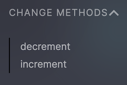

# Using RAEN

Now let's use RAEN to build the contract.

From within the `counter` directory run the build command:

```bash
raen build --release
```

This does a few things:

1. Runs [`cargo build`](https://doc.rust-lang.org/stable/book/ch01-03-hello-cargo.html) in a smart way:

   - Passes along relevant flags, such as [`--release`](https://doc.rust-lang.org/cargo/reference/profiles.html#release)
   - Adds essential NEAR flags, such as `--target wasm32-unknown-unknown`.

   This creates a Wasm file at `./target/wasm32-unknown-unknown/target/counter.wasm`

2. Uses [witme](https://github.com/AhaLabs/witme) to inspect the contract's Rust code and generates [Wit](https://github.com/bytecodealliance/wit-bindgen) from it. Wit is a an emerging standard for describing the interfaces of Wasm binaries, on track to eventually merge with Wasm itself.

3. Creates a new Wasm file copied from the one generated in Step 1, injecting the Wit into a [Custom Section](https://webassembly.github.io/spec/core/appendix/custom.html).

4. Compresses this new Wasm file and saves it to `./target/res/counter.wasm`. This compression makes the final result smaller than contracts built without RAEN, even with the Wit added. That's a good thing! Blockchains are space-constrained, and you'll need to pay for [storage costs](https://docs.near.org/docs/concepts/storage-staking).

The TL;DR is that `raen build` is a fast, safe way to build your smart contracts, and it adds interface types to your contract which can then be used by other tooling, such as RAEN Admin.

## Deploy

As mentioned in [Getting Set Up](../intro/getting-set-up.md), `raen` will eventually wrap `near-cli`. But for now, you need the `near` command to deploy:

```bash
near dev-deploy ./target/res/counter_contract.wasm
```

This will create a new throwaway NEAR account on testnet and deploy the contract to that address.

If you're using a bash-compatible shell such as `zsh`, you can use [command substitution](https://hyperpolyglot.org/unix-shells#cmd-subst-note) to `build` & `dev-deploy` in one step:

```bash
near dev-deploy $(raen build --release -q)
```

Note that this adds a `-q` flag to `raen build`, making it _quiet_. This means it only outputs the location of the built file.

Copy the contract address mentioned by the `dev-deploy` output; it will look something like `dev-1234-1234` but longer. Now head over to [raen.dev/admin](https://raen.dev/admin) and paste that address into the big box.

Like a good cooking show, a fully-cooked contract has already been deployed. If you're not following along with your own code, you can use RAEN Admin to investigate [`counter.raendev.testnet`](https://raen.dev/admin/#/counter.raendev.testnet).

## RAEN Admin

Now that your RAEN-built contract provides interface information, [RAEN Admin](https://raen.dev/admin) can use it to generate a complete interactive form.

### View Methods

First, notice on the top left that you have a login button and a list of view methods


Clicking on [`get_num`](https://raen.dev/admin/#/counter.raendev.testnet/GetNum) will immediately call the view method since it has no arguments.

You can also see that the comment from the code is displayed, helping to describe the method.


### Change Methods

Below View Methods, you'll see Change Methods.



Let's pick [`increment`](https://raen.dev/admin/#/counter.raendev.testnet/Increment).


Again you can see the comments from the code. However, now there are two new fields in the form. 

- `attachedDeposit` is how much near you want to attach to the transaction; it is in [yocto](https://en.wikipedia.org/wiki/Yocto-)Near, which is the smallest unit of NEAR (`1N = 1000000000000000000000000 yN` or `10^24`).
- `gas` is how much gas to attach to cover the execution costs. It is in [units of gas](https://docs.near.org/docs/concepts/gas), here 30 [Tera](https://en.wikipedia.org/wiki/Tera-)Gas—more than enough for this transaction.

You will need to sign in to submit this form. If you don't have a NEAR [testnet](https://docs.near.org/docs/concepts/networks#testnet) account, NEAR Wallet will guide you through creating one.

Once you sign in and submit the `increment` form, you can revisit [`get_num`](https://raen.dev/admin/#/counter.raendev.testnet/GetNum) and see that it is now `1` (or probably something else, if you're using `counter.raendev.testnet`).

## Digging deeper: look, no NEAR Wallet confirmation

If you're used to Ethereum apps, you may be surprised that submitting the `increment` form didn't require any confirmation to spend your testnet NEAR tokens on transaction fees.

NEAR prioritizes both developer and user experience. One way it accomplishes good user experience: [negligible and predictable transaction fees](https://docs.near.org/docs/concepts/gas), also called _gas_ fees. And then, if gas fees are negligible for most transactions, why bother requiring user confirmation over and over and over?

Here is what actually happens when you sign in with NEAR:

- NEAR Wallet adds a new [FunctionCall Access Key](https://docs.near.org/docs/concepts/access-keys) to your account. You can see this listed in the "Recent activity" section on [wallet.testnet.near.org](https://wallet.testnet.near.org). In a nutshell:
  - This key can ONLY make calls to the `counter.raendev.testnet` contract (or your version of it)
  - This key has an allowance of **0.25 NEAR** that it can spend on transaction fees on your behalf. If you use RAEN Admin for long enough to exhaust this allowance, every call to a Change Method will start redirecting to NEAR Wallet.
  - If a transaction has an `attachedDeposit`, no matter how small, it WILL require explicit user confirmation.

- NEAR Wallet redirects to the previous URL at `raen.dev/admin`, adding some extra URL parameters with information about this new Access Key.

- `raen.dev/admin`, using default behavior in [near-api-js](https://docs.near.org/docs/api/javascript-library), adds this key to [localStorage](https://developer.mozilla.org/en-US/docs/Web/API/Window/localStorage) in your browser. If you know your way around your browser's [Web Inspector](https://developer.chrome.com/docs/devtools/storage/localstorage/), you can use it to see your key (be careful! this is a private key! but also it can only call `counter.raendev.testnet` and can only spend 0.25 NEAR, so maybe you don't need to be _too_ careful).

## Summary

Congratulations! You deployed your first NEAR smart contract. And since you built it with `raen`, you were able to interact with your contract using RAEN Admin. This required creating your first NEAR testnet account, which taught you a little bit about NEAR's account system. Named accounts! Multiple access keys for each account! Great UX that doesn't require confirming every negligible transaction.

Now let's investigate a bug in this contract, and learn how to fix it and deploy an updated version of the contract.
